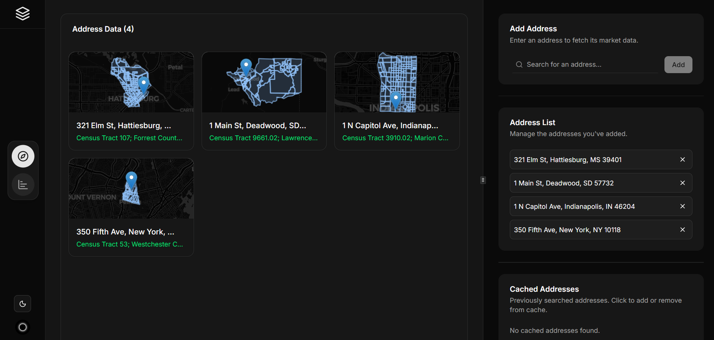

# CapMatch: Market Card Data Automation

This is a full-stack application built for the CapMatch take-home assignment. It dynamically generates a comprehensive "Population Context" market card for any U.S. address, sourcing data from credible public APIs in real-time.



---

## 🚀 Live Demo, Walkthrough & Architecture

*   **Live Application:** **[SK CapMatch](https://sk-capmatch.existence.technology)**
*   **Video Walkthrough:** **[Loom Video Link](https://www.loom.com/share/your-video-link)**

---

## ✨ Key Features

*   **Dynamic Data Fetching:** Enter any U.S. address to generate a detailed population market card.
*   **Comprehensive Metrics:** Goes beyond simple growth to include demographics, economic indicators, housing data, migration drivers, and more.
*   **Interactive Visualizations:** Data is presented with interactive charts, graphs, and a map showing the census tract boundary.
*   **"Explore" Mode:** View and manage multiple address cards on a single dashboard.
*   **"Compare" Mode:** A powerful tool to compare population trends, demographics, and housing metrics across multiple addresses side-by-side.
*   **Intelligent Caching:** A robust PostgreSQL-backed caching layer ensures subsequent requests for the same address are instantaneous.
*   **Address Autocomplete:** Powered by the Google Places API for a smooth user experience.
*   **Secure Authentication:** User accounts and protected routes are managed with Firebase Authentication.
*   **Modern UI/UX:** A clean, responsive interface with light/dark modes, built with Next.js and shadcn/ui.
*   **Performance Optimized:** Backend is designed for speed, using concurrent API calls to meet the <30 second data-fetch requirement.

---

## 🛠️ Tech Stack

| Category      | Technology                                                              |
|---------------|-------------------------------------------------------------------------|
| **Frontend**  | [Next.js](https://nextjs.org/), [React](https://reactjs.org/), [TypeScript](https://www.typescriptlang.org/), [Tailwind CSS](https://tailwindcss.com/), [shadcn/ui](https://ui.shadcn.com/) |
| **State Mgmt**| [React Query (TanStack)](https://tanstack.com/query/latest) (Server State), [Zustand](https://zustand-demo.pmnd.rs/) (UI State) |
| **Backend**   | [FastAPI](https://fastapi.tiangolo.com/), [Python 3.11](https://www.python.org/), [SQLAlchemy 2.0](https://www.sqlalchemy.org/) (Async) |
| **Database**  | [PostgreSQL](https://www.postgresql.org/) (for Caching), [Alembic](https://alembic.sqlalchemy.org/) (Migrations) |
| **Data APIs** | U.S. Census Bureau (ACS, PEP, TIGERweb), Google Places, Walk Score®      |
| **Deployment**| [Docker](https://www.docker.com/), Docker Compose, GitHub Actions                         |
| **Auth**      | [Firebase Authentication](https://firebase.google.com/docs/auth)        |

---

## 🏗️ Architecture Overview

The system is a decoupled full-stack application orchestrated with Docker Compose.

1.  **Client (Next.js):** The user interacts with the React-based frontend. All API requests are sent to a Next.js API route, which acts as a proxy.
2.  **API Proxy (Next.js):** This proxy forwards requests to the backend, preventing CORS issues and hiding the backend URL from the client. It also attaches the user's Firebase auth token.
3.  **Backend (FastAPI):** The high-performance Python backend receives the request.
    *   It first checks the **PostgreSQL cache** for existing data.
    *   If a cache miss occurs, it concurrently calls all necessary external APIs (Census, Walk Score, etc.) using `asyncio` and `httpx`.
    *   Data is processed, aggregated, and formatted into the final JSON response.
    *   The new response is stored in the cache before being sent back to the client.
4.  **Database (PostgreSQL):** A persistent cache store for API responses, keyed by a normalized address.

---

## ⚙️ Running Locally

### Prerequisites

*   [Docker](https://www.docker.com/get-started/) and Docker Compose
*   [Node.js](https://nodejs.org/) (v20+) and a package manager (npm, yarn, or pnpm)
*   API Keys from external services (see `.env` setup)

### 1. Clone the Repository

```bash
git clone https://github.com/your-username/your-repo-name.git
cd your-repo-name
```

### 2. Set Up Environment Variables

You will need to create `.env` files for both the backend and frontend. Template files are provided.

**Backend:**

```bash
cp src/backend/.env.template src/backend/.env
```

Now, open `src/backend/.env` and fill in the following values:
*   `FIREBASE_SERVICE_ACCOUNT_BASE64`: Generate a service account key from your Firebase project settings. Base64 encode the entire JSON file and paste the string here.
    *   On Linux/macOS: `base64 -w 0 path/to/your/serviceAccountKey.json`
*   `FIREBASE_PROJECT_ID`: Your Firebase project ID.
*   `CENSUS_API_KEY`: Get a key from the [Census API Key Signup](https://api.census.gov/data/key_signup.html).
*   `WALKSCORE_API_KEY`: Get a key from [Walk Score API](https://www.walkscore.com/professional/api.php).

**Frontend:**

```bash
cp src/frontend/.env.template src/frontend/.env
```

Now, open `src/frontend/.env` and fill in the following values from your Firebase project's web app settings:
*   `NEXT_PUBLIC_FIREBASE_API_KEY`
*   `NEXT_PUBLIC_FIREBASE_AUTH_DOMAIN`
*   `NEXT_PUBLIC_FIREBASE_PROJECT_ID`
*   ...and other Firebase variables.
*   `GOOGLE_PLACES_API_KEY`: A Google Cloud API key with the "Places API" enabled. This is used for the address autocomplete feature and is called from a server-side route, so it is not exposed to the client.
*   `BACKEND_API_URL`: The URL of your FastAPI backend (e.g., `http://localhost:5000`). This is used by the frontend to proxy API requests to the backend server.

### 3. Build and Run with Docker

Once the environment variables are set, you can start the entire application with a single command:

```bash
docker-compose up --build
```

The application will be available at **[http://localhost:3000](http://localhost:3000)**. The backend API runs on port 5000 but is proxied through the frontend.

---

## 💡 Design Decisions & Rationale

*   **Performance:** The core challenge was meeting the <30 second requirement. This was achieved by using a fully asynchronous backend (FastAPI, `asyncpg`, `httpx`) and running all external API calls concurrently with `asyncio.gather`. This parallelization is the key to minimizing the total wait time.
*   **Robustness:** A persistent PostgreSQL cache was chosen over an in-memory solution to ensure data survives server restarts. The `tenacity` library is used on the backend to automatically retry failed API calls with exponential backoff, making the system resilient to transient network errors.
*   **Scalability & Maintainability:** The backend is built with a clean, service-oriented architecture. Logic is separated into distinct services (`GeocodingService`, `CensusAPIClient`, `CacheManager`, `DataProcessor`), making the codebase easy to understand, test, and extend.
*   **Modern Frontend:** React Query was chosen to handle server state, caching, and data fetching on the client. This simplifies logic, eliminates boilerplate, and provides a great user experience with features like automatic refetching and error handling. Zustand is used for minimal, shared UI state (like the current mode).
*   **Developer Experience:** Dockerizing the entire stack ensures a consistent and reproducible development environment, simplifying setup for any developer.

---

## 🔮 Future Improvements

*   **Add More Market Cards:** The architecture is extensible. New cards (Job Growth, Supply Pipeline) could be added by creating new services on the backend and corresponding components on the frontend.
*   **Expanded Test Coverage:** Implement more comprehensive unit and integration tests for both the frontend and backend to ensure long-term stability.
*   **User-Saved Lists:** Allow authenticated users to save, name, and manage lists of addresses for future analysis.
* **Scalability:** Migrate to Kubernetes for container orchestration, automated scaling, and zero-downtime deployments. This would enable rolling updates, better resource management, and seamless integration with cloud services (e.g., managed PostgreSQL, secrets management). Alternatively, platforms like AWS ECS or Google Cloud Run could be used for simplified container hosting and scaling.